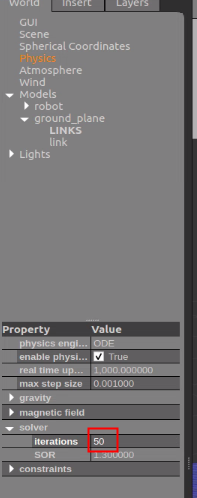

# cobot s sim 	

# 环境安装

ros环境

```
sudo apt-get install ros-noetic-desktop-full 
```

moveit 

```
sudo apt-get install ros-noetic-moveit-*
```

controller

```
sudo apt-get install ros-noetic-gazebo-ros ros-noetic-gazebo-ros-control ros-noetic-gazebo-ros-pkgs ros-noetic-control-* ros-noetic-velodyne* ros-noetic-roboticsgroup-upatras-gazebo-plugins ros-noetic-robotis-manipulator ros-noetic-effort-controllers ros-noetic-joint-trajectory-action ros-noetic-joint-state-controller ros-noetic-position-controllers ros-noetic-effort-controllers ros-noetic-gripper-action-controller ros-noetic-joint-trajectory-controller
```

创建工作空间

```
mkdir -p scout_cobot_ws/src
```

下载代码

```
https://github.com/agilexrobotics/scout_cobot_sim.git
```

进入工作空间编译代码

```
cd cobot_s_ws/src
catkin_init_workspace 
cd ..
catkin_make
```

声明环境变量

```
source devel/setup.bash
```

# 启动gazebo仿真

1）scout+cr5

```
roslaunch scout_cobot_cr5_moveit demo_gazebo.launch 
```

2）scout+xarm6

```
roslaunch scout_cobot_xarm_moveit demo_gazebo.launch 
```

# 控制夹爪

控制夹爪闭合

```
rostopic pub /gripper_controller/gripper_cmd/goal control_msgs/GripperCommandActionGoal "header:
  seq: 0
  stamp:
    secs: 0
    nsecs: 0
  frame_id: ''
goal_id:
  stamp:
    secs: 0
    nsecs: 0
  id: ''
goal:
  command:
    position: 10.0
    max_effort: 10.0" 

```

控制夹爪张开

```
rostopic pub /gripper_controller/gripper_cmd/goal control_msgs/GripperCommandActionGoal "header:
  seq: 0
  stamp:
    secs: 0
    nsecs: 0
  frame_id: ''
goal_id:
  stamp:
    secs: 0
    nsecs: 0
  id: ''
goal:
  command:
    position: 0.0
    max_effort: 10.0" 
```


# 问题处理

如模型在运动过程中出现崩溃现象，可以尝试修改以下参数；gazebo 中的物理参数，**迭代次数从50改为100或者更大**

